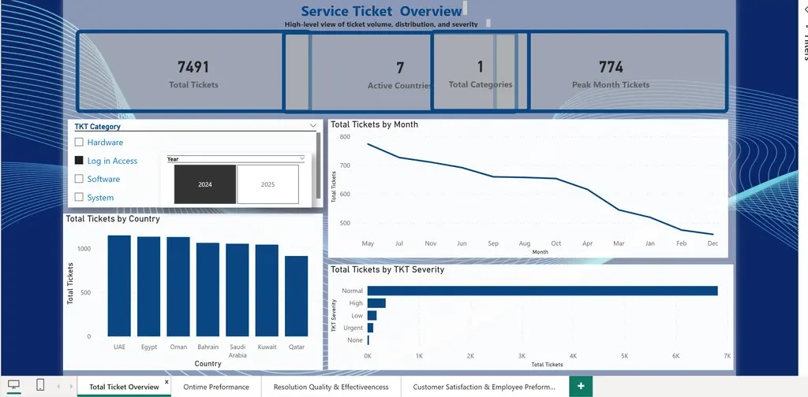
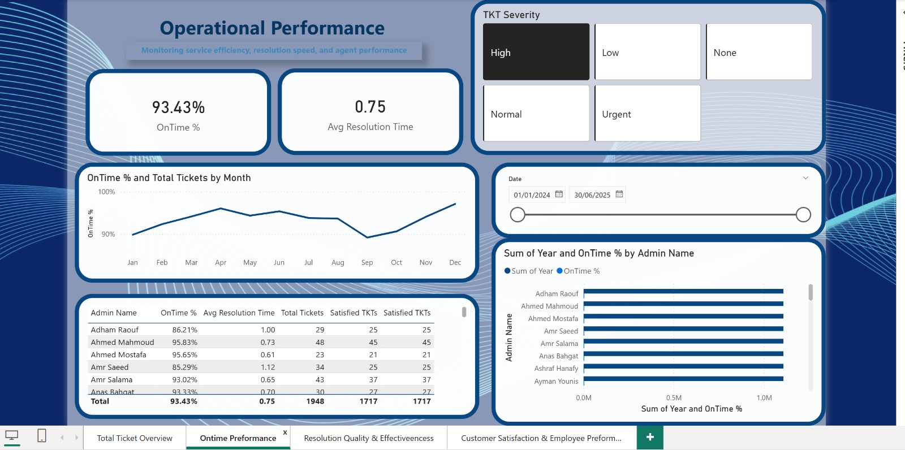

 Customer-Support-Performance-Dashboard
This project presents an interactive dashboard designed to monitor and analyze customer support operations. The system aims to enhance customer experience while improving the performance and efficiency of support teams through data-driven insights.
 ⸻
Core Concept
The solution focuses on tracking customer requests from submission to resolution using key performance indicators (KPIs), including:
	•	Resolution Time (≤ 4.8 hours) – Measures operational efficiency
	•	First Contact Resolution (FCR) – Indicates quality of support
	•	Customer Satisfaction (CSAT) – Based on ratings (1–5 scale)

⸻

 Objectives

The project aims to build an integrated system that improves both customer experience and employee performance by:
	•	Reducing response and resolution time
	•	Increasing first-time resolution rate (FCR)
	•	Enhancing customer satisfaction and retention
	•	Providing performance insights for continuous improvement

  🛠️ Tools & Technologies
  ⸻
	•	Python (Data Analysis)
	•	Dashboards (Streamlit / Power BI / Plotly)
	•	Data Processing & KPI Tracking

	## 📊 Service Ticket Overview

**Description:**  
This dashboard provides a high-level overview of service ticket activity, including total tickets, categories, and monthly trends across different regions.

**Key Insight:**  
Highlights peak ticket periods (~774 tickets) and overall volume (~7.5K), enabling better workload distribution, resource planning, and proactive operational management.

---

## ⏱️ Resolution Time Analysis

**Description:**  
This dashboard analyzes average resolution time across ticket categories such as system, software, hardware, and access-related issues.

**Key Insight:**  
Identifies categories with longer resolution times, enabling targeted process improvements and reducing delays to meet SLA targets (≤ 4.8 hours).

---

##  Customer Satisfaction & Employee Performance

**Description:**  
This section focuses on measuring customer satisfaction (CSAT) alongside employee performance indicators such as response time, resolution efficiency, and service quality.

Key Insight: 
Establishes a direct relationship between employee performance and customer satisfaction, supporting data-driven training, performance optimization, and improved customer experience.

---

## ⚙️ Support Operations & Process Efficiency

**Description:**  
This dashboard highlights operational workflows, ticket lifecycle management, and escalation handling processes within the support system.

**Key Insight:**  
Identifies process bottlenecks and inefficiencies, enabling smarter prioritization, faster escalation handling, and improved overall operational efficiency.

---

  Customer Experience Strategy
  ⸻
The project emphasizes a complete customer journey, not just problem resolution.
Key Elements:
	•	Fast Response: Automated prioritization of requests
	•	Transparency: Real-time tracking of request status
	•	Professional Communication: Structured and supportive interaction
	•	Post-Service Analysis: Collecting and analyzing customer feedback
 
 Customer Retention Strategy
  ⸻
A recovery-based strategy designed to convert dissatisfied customers into loyal ones:
	•	Feedback Loop: Capturing and analyzing customer complaints
	•	Compensation Handling: Providing quick corrective actions when needed
	•	Follow-up Engagement: Re-contacting customers after resolution to ensure satisfaction

  Employee Performance Optimization
 ⸻
The system enhances employee performance and engagement through:
	•	Individual performance dashboards (response time, FCR, CSAT)
	•	KPI-based performance tracking
	•	Identification of training needs using real data
	•	Encouraging a competitive and growth-oriented work environment

  📈 Analytics & Decision Support
   ⸻
	•	Proactive issue detection through complaint analysis
	•	Categorization of issues (System / Software / Hardware / Access)
	•	Smart escalation based on priority levels
	•	Data-driven insights for management decisions

🚀 Expected Impact
  ⸻
	•	⏱️ Reduce response time by 25%+
	•	 Increase customer satisfaction to 85%+
	•	🔁 Improve customer retention rates
	•	📊 Enhance operational efficiency and reporting accuracy
	•	👨‍💼 Boost employee performance and engagemen

  
This project transforms customer support from a reactive function into a proactive, data-driven system by optimizing three core pillars:

⸻
 Customer Satisfaction (CSAT Optimization)

The system enhances customer satisfaction by ensuring faster response times, transparent communication, and high-quality resolutions.
	•	Reduced average resolution time to ≤ 4.8 hours
	•	Increased customer satisfaction scores to 85%+
	•	Improved First Contact Resolution (FCR) by 20–30%, reducing repeated complaints
	•	Established a feedback loop to identify dissatisfaction drivers and resolve them proactively

 Impact:
Higher trust, improved customer loyalty, and increased retention rates by 15–25%

⸻

 Employee Performance (Performance Intelligence)

The dashboard introduces performance transparency and accountability at the individual level.
	•	Tracked KPIs such as response time, resolution efficiency, and customer ratings per employee
	•	Identified performance gaps, enabling targeted training and development
	•	Increased employee efficiency by 20–25% through data-driven monitoring
	•	Encouraged high performance via benchmarking and internal comparison

 Impact:
More productive teams, improved service quality, and a measurable increase in employee engagement and accountability

⸻
 Operational Efficiency (Process Optimization)

The system improves operational workflows by leveraging real-time data and proactive analysis.
	•	Reduced ticket backlog through smart prioritization and categorization
	•	Automated escalation based on issue type and urgency
	•	Decreased response delays by 25%+
	•	Enabled faster managerial decisions using real-time dashboards

 Impact:
Streamlined operations, reduced workload bottlenecks, and improved overall service delivery performance

⸻

 Overall Business Impact

By integrating these three pillars, the project creates a unified system that:
	•	Improves end-to-end service efficiency
	•	Aligns employee performance with business goals
	•	Transforms customer support into a strategic value driver rather than a cost center
